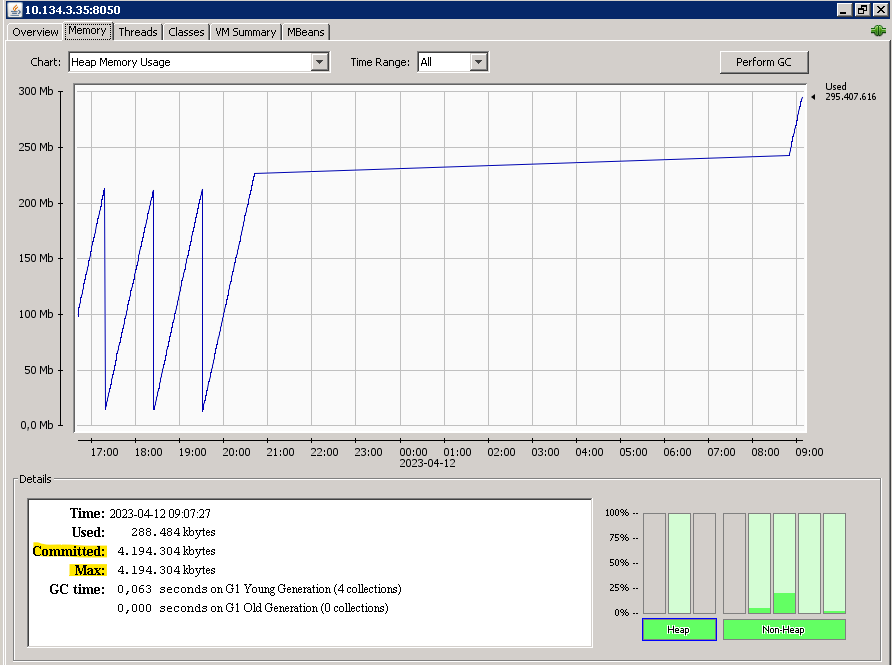

Configurar Memory Usage
===================================

Crear un nuevo script con el nombre de  **setenv.sh** en la carpeta $TOMCAT_HOME/bin con el siguiente contenido::

  export CATALINA_OPTS="$CATALINA_OPTS -Xms4g"
  export CATALINA_OPTS="$CATALINA_OPTS -Xmx4g"
  export CATALINA_OPTS="$CATALINA_OPTS -XX:MaxPermSize=256m"

Después de crear el script, Tomcat debe reiniciarse para que los cambios surtan efecto.

Argumentos setenv
++++++++++++++++++

**-Xms**: este es el tamaño inicial del almacenamiento dinámico de Java.

**-Xmx**: este es el tamaño máximo de almacenamiento dinámico de Java.

El Heap es el espacio de memoria que contiene todos los objetos creados por su aplicación, es el espacio de memoria asignado para su aplicación, normalmente una aplicación no requeriría más de un máximo de 2 GB de memoria. En caso de poco espacio de almacenamiento dinámico, se lanza la excepción "OutOfMemoryError: java heap space".

**-XX:PermSize**: este es el tamaño de generación permanente inicial.

**-XX**: MaxPermSize: este es el tamaño máximo de generación permanente.

El tamaño de gem permanente es el espacio donde se almacena su base de código dentro de la memoria, cuanto más grande sea su base de código, más espacio de generación permanente se requiere, normalmente la aplicación no requeriría más de un máximo de 1 GB de espacio de generación permanente. En caso de espacio de generación de permiso bajo, se lanza la excepción "OutOfMemoryError: PermGen".

Cuando asignas la memoria a la JVM, posiblemente no se vea el tamaño total en el SO, ejemplo:

Asignamos 4Gb a la JVM y ejecutamos el siguiente comando en y vemos como el RSS dice que solo tiene 441214Kb utilizado::

  ps -ylC java
  S   UID     PID    PPID  C PRI  NI   RSS    SZ WCHAN  TTY          TIME CMD
  S 30010  999064       1  0  80   0 441244 2034483 futex_ ?     00:02:19 java

Pero al configurar el JMX remote y conectar un jconsole podemos observar que si indica que tiene los 4Gb.

