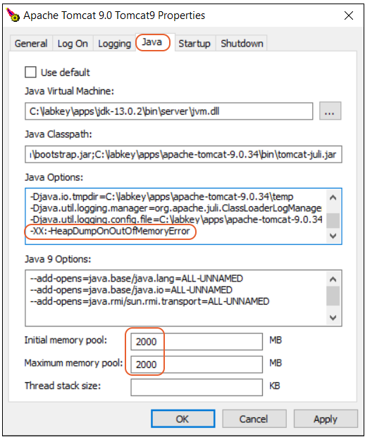

Cambiar la configuración de la memoria JVM en Windows
========================================================

Tomcat generalmente se inicia como un servicio en Windows e incluye un cuadro de diálogo para configurar la JVM. La asignación de memoria total máxima se configura en su propio cuadro de texto, pero otras configuraciones se configuran en el cuadro de opciones generales de JVM utilizando la sintaxis de parámetros de la línea de comandos de Java.

Si cambió el nombre del servicio de Windows, debe usar el método 2.

Método 1:
+++++++++++

1.- Abra el Explorador de Windows.

2.- Vaya al directorio <CATALINA_HOME>/bin .

3.- Busque y ejecute el archivo tomcat#w.exe (donde # es el número de versión de Tomcat). Ejecute esto como administrador haciendo clic con el botón derecho en el archivo .exe y seleccionando Ejecutar como administrador .

4.- El comando abrirá una ventana del programa.

5.- Si esto produce un error que dice "El servicio especificado no existe en el servidor", vaya al Método 2.

6.- Vaya a la pestaña Java en la nueva ventana.

7.- En el cuadro Opciones de Java , desplácese hasta la parte inferior de las propiedades y establezca la siguiente propiedad::

  -XX:-HeapDumpOnOutOfMemoryError

8.- Cambie el grupo de memoria inicial a 2000 MB para un servidor de prueba o 4000 MB para un servidor de producción.

9.- Cambie el grupo de memoria máxima al mismo valor.

10- Haga clic en Aceptar.

11.- Reinicie el servicio.

Método 2:
+++++++++

Deberá usar este método si personalizó el nombre del servicio de Windows.

Abra un símbolo del sistema. (Haga clic en Inicio, escriba "cmd" y presione la tecla Intro).

Navegue hasta el directorio bin <CATALINA_HOME> .

Ejecute el siguiente comando y realice los cambios apropiados si está ejecutando una versión diferente de Tomcat. Este ejemplo es para Tomcat 9::

  tomcat9w.exe //ES//LabKeyTomcat9
  
El comando abrirá una ventana del programa.

Si esto produce un error que dice "El servicio especificado no existe en el servidor", consulte la nota a continuación .

Vaya a la pestaña Java en la nueva ventana.

En el cuadro Opciones de Java , desplácese hasta la parte inferior de las propiedades y establezca la siguiente propiedad::

  -XX:-HeapDumpOnOutOfMemoryError
  
Cambie el grupo de memoria inicial a 2 GB para un servidor de prueba o 4 GB para un servidor de producción.

Cambie el grupo de memoria máxima al mismo valor.

Haga clic en el botón Aceptar

Reinicie el servicio.

NOTA: El texto después de //ES// debe coincidir exactamente con el nombre del servicio de Windows que se utiliza para iniciar/detener su servicio. Puede determinar el nombre de su servicio de Windows realizando las siguientes acciones:

Abra el panel de Servicios de Windows. (Haga clic en Inicio, escriba "Servicios" y presione la tecla Intro).

En el panel Servicios, busque la entrada para LabKey Server. Podría llamarse algo así como Apache Tomcat o LabKey

Haga doble clic en el servicio para abrir el cuadro de diálogo de propiedades.

En el comando anterior, reemplace el texto "LabKeyTomcat#" con el texto que se muestra junto a ServiceName en el cuadro de diálogo Propiedades.
