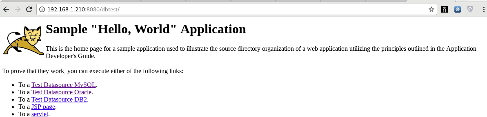

Configurar y probar Datasource 
===============================

Lo primero es leer la documentación oficial de Tomcat.

https://tomcat.apache.org/tomcat-8.0-doc/jndi-datasource-examples-howto.html

Instalación rápida de Tomcat
++++++++++++++++++++++++++++

Descargamos la versión de Tomcat que se requiera y la descomprimimos.::

	# tar xvf apache-tomcat-8.5.34.tar.gz -C /opt/

Iniciamos el apache y no debemos ver errores en el LOG.::

	# /opt/apache-tomcat-8.5.34/bin/catalina.sh start

	# tail -f /opt/apache-tomcat-8.5.34/logs/catalina.out &

Verificamos que no tengamos errores e ingresamos al URL http://IPSERVER:8080/

Para MySQL
+++++++++++

Vamos rápido a crear una BD de prueba.::
	
	# mysql -uroot -pr00tme

	mysql> GRANT ALL PRIVILEGES ON *.* TO javauser@localhost IDENTIFIED BY 'javadude' WITH GRANT OPTION;
	mysql> GRANT ALL PRIVILEGES ON *.* TO javauser@* IDENTIFIED BY 'javadude' WITH GRANT OPTION;
	mysql> create database javatest;
	mysql> use javatest;
	mysql> create table testdata (id int not null auto_increment primary key,foo varchar(25),bar int);

	# touch insert-users.sql && echo "use javatest;" > insert-users.sql
	# for i in {1..100} ; do echo -e "insert into testdata values(null, \"user$i\", 12345$i);" >> insert-users.sql ;done

	# mysql -uroot -pr00tme < insert-users.sql

Hacemos primero una configuración que es igual para todos los manejadores de BD, pero vamos a comenzar con MySQL.

Antes de continuar, no olvide copiar el archivo jar del controlador JDBC en $CATALINA_HOME/lib.::

	# cp mysql-connector-java-5.1.47.jar /opt/apache-tomcat-8.5.34/lib/

Editamos el context.xml del Tomcat para agregar estas lineas dentro del <contex> </context>.::

	# vi /opt/apache-tomcat-8.5.34/conf/context.xml

	<Resource name="jdbc/TestDB" auth="Container" type="javax.sql.DataSource"
		     maxTotal="100" maxIdle="30" maxWaitMillis="10000"
		     username="javauser" password="javadude" driverClassName="com.mysql.jdbc.Driver"
		     url="jdbc:mysql://localhost:3306/javatest"/>

Reiniciamos el Tomcat.::

	# /opt/apache-tomcat-8.5.34/bin/catalina.sh stop
	# /opt/apache-tomcat-8.5.34/bin/catalina.sh start

Ya con esto el Tomcat esta listo para trabajar con Datasource, ahora depende del aplicativo como lo hace.

Para Oracle
+++++++++++

Hacemos primero una configuración que es igual para todos los manejadores de BD, vamos con Oracle

Antes de continuar, no olvide copiar el archivo jar del controlador JDBC en $CATALINA_HOME/lib.::

	# cp ojdbc6.jar /opt/apache-tomcat-8.5.34/lib/

Editamos el context.xml del Tomcat para agregar estas lineas dentro del <contex> </context>.::

	# vi /opt/apache-tomcat-8.5.34/conf/context.xml

	<Resource name="jdbc/OracleDS" auth="Container"
		      type="javax.sql.DataSource" driverClassName="oracle.jdbc.OracleDriver"
		      url="jdbc:oracle:thin:@192.168.1.53:1521:qa12c"
		      username="QA_RRGTGU_V138" password="QA_RRGTGU_V138" maxTotal="20" maxIdle="10"
		      maxWaitMillis="-1"/>

Reiniciamos el Tomcat.::

	# /opt/apache-tomcat-8.5.34/bin/catalina.sh stop
	# /opt/apache-tomcat-8.5.34/bin/catalina.sh start

Ya con esto el Tomcat esta listo para trabajar con Datasource de Oracle, ahora depende del aplicativo como lo hace.

Para DB2
+++++++++++

Hacemos primero una configuración que es igual para todos los manejadores de BD, vamos con DB2

Antes de continuar, **no olvide copiar los dos 2 archivo jar** del controlador JDBC en $CATALINA_HOME/lib.::

	# cp db2jcc.jar db2jcc4.jar /opt/apache-tomcat-8.5.34/lib/

Editamos el context.xml del Tomcat para agregar estas lineas dentro del <contex> </context>.::

	# vi /opt/apache-tomcat-8.5.34/conf/context.xml

	Resource name="jdbc/db2" auth="Container"
		      type="javax.sql.DataSource" driverClassName="com.ibm.db2.jcc.DB2Driver"
		      url="jdbc:db2://192.168.1.21:50000/BGSAMPLE"
		      username="db2inst1" password="password1" maxTotal="20" maxIdle="10"
		      maxWaitMillis="-1"/>

Reiniciamos el Tomcat.::

	# /opt/apache-tomcat-8.5.34/bin/catalina.sh stop
	# /opt/apache-tomcat-8.5.34/bin/catalina.sh start

Ya con esto el Tomcat esta listo para trabajar con Datasource de DB2, ahora depende del aplicativo como lo hace.

Test del datasource con un código JSP
+++++++++++++++++++++++++++++++++++++

Creamos un directorio de trabajo.::

	# mkdir dbtest
	# cd dbtest

Creamos la estructura de directorios.::

	# mkdir -p images WEB-INF/classes/mypackage WEB-INF/lib

Copiamos alguna imagen.::

	# cp ../../../../tomcat.gif images/

Copiamos la clase que ya en otro momento compilamos.::

	# cp -p ../../../../Hello.class WEB-INF/classes/mypackage/

Creamos el web.xml.::

	# vi WEB-INF/web.xml

	<?xml version="1.0" encoding="ISO-8859-1"?>
	<web-app xmlns="http://java.sun.com/xml/ns/j2ee"
	    xmlns:xsi="http://www.w3.org/2001/XMLSchema-instance"
	    xsi:schemaLocation="http://java.sun.com/xml/ns/j2ee http://java.sun.com/xml/ns/j2ee/web-app_2_4.xsd"
	    version="2.4">

	    <display-name>Hello, World Application</display-name>
	    <description>
		This is a simple web application with a source code organization
		based on the recommendations of the Application Developer's Guide.
	    </description>

	    <servlet>
		<servlet-name>HelloServlet</servlet-name>
		<servlet-class>mypackage.Hello</servlet-class>
	    </servlet>

	    <servlet-mapping>
		<servlet-name>HelloServlet</servlet-name>
		<url-pattern>/hello</url-pattern>
	    </servlet-mapping>

	<resource-ref>
	      <description>DB Connection</description>
	      <res-ref-name>jdbc/TestDB</res-ref-name>
	      <res-type>javax.sql.DataSource</res-type>
	      <res-auth>Container</res-auth>
	  </resource-ref>

	  <resource-ref>
	      <description>Oracle Datasource example</description>
	      <res-ref-name>jdbc/OracleDS</res-ref-name>
	      <res-type>javax.sql.DataSource</res-type>
	      <res-auth>Container</res-auth>
	  </resource-ref>

	  <resource-ref>
	      <description>DB2 Datasource example for DB2</description>
	      <res-ref-name>jdbc/db2</res-ref-name>
	      <res-type>javax.sql.DataSource</res-type>
	      <res-auth>Container</res-auth>
	  </resource-ref>

	</web-app>

Creamos el index.html.::

	# vi index.html

	<html>
	<head>
	<title>Sample "Hello, World" Application</title>
	</head>
	<body bgcolor=white>

	<table border="0">
	<tr>
	<td>
	
	</td>
	<td>
	<h1>Sample "Hello, World" Application</h1>
	
This is the home page for a sample application used to illustrate the
	source directory organization of a web application utilizing the principles
	outlined in the Application Developer's Guide.
	</td>
	</tr>
	</table>

	
To prove that they work, you can execute either of the following links:
	<ul>
	<li>To a <a href="dbtestmysql.jsp">Test Datasource MySQL</a>.
	<li>To a <a href="dbtestoracle.jsp">Test Datasource Oracle</a>.
	<li>To a <a href="dbtestdb2.jsp">Test Datasource DB2</a>.
	<li>To a <a href="hello.jsp">JSP page</a>.
	<li>To a <a href="hello">servlet</a>.
	</ul>

	</body>
	</html>

Creamos una JSP solo de demo, llamado hello.jsp, esto se puede omitir.::

	<html>
	<head>
	<title>Sample Application JSP Page</title>
	</head>
	<body bgcolor=white>

	<table border="0">
	<tr>
	<td align=center>
	
	</td>
	<td>
	<h1>Sample Application JSP Page</h1>
	This is the output of a JSP page that is part of the Hello, World
	application.
	</td>
	</tr>
	</table>

	<%= new String("Hello!") %>

	</body>
	</html>

Creamos nuestras paginas de test en JSP para cada datasource.
Para MySQL y la llamamos dbtestmysql.jsp .::

	<%@page import="java.sql.*, javax.sql.*, javax.naming.*"%>
	<html>
	<head>
	<title>Using a DataSource</title>
	</head>
	<body>
	<h1>Using a DataSource</h1>
	<%
	    DataSource ds = null;
	    Connection conn = null;
	    ResultSet result = null;
	    Statement stmt = null;
	    ResultSetMetaData rsmd = null;
	    try{
	      Context context = new InitialContext();
	      Context envCtx = (Context) context.lookup("java:comp/env");
	      ds =  (DataSource)envCtx.lookup("jdbc/TestDB");
	      if (ds != null) {
		conn = ds.getConnection();
		stmt = conn.createStatement();
		result = stmt.executeQuery("SELECT * FROM testdata");
	       }
	     }
	     catch (SQLException e) {
		System.out.println("Error occurred " + e);
	      }
	      int columns=0;
	      try {
		rsmd = result.getMetaData();
		columns = rsmd.getColumnCount();
	      }
	      catch (SQLException e) {
		 System.out.println("Error occurred " + e);
	      }
	 %>
	 <table width="90%" border="1">
	   <tr>
	   <% // write out the header cells containing the column labels
	      try {
		 for (int i=1; i<=columns; i++) {
		      out.write("<th>" + rsmd.getColumnLabel(i) + "</th>");
		 }
	   %>
	   </tr>
	   <% // now write out one row for each entry in the database table
		 while (result.next()) {
		    out.write("<tr>");
		    for (int i=1; i<=columns; i++) {
		      out.write("<td>" + result.getString(i) + "</td>");
		    }
		    out.write("</tr>");
		 }
	 
		 // close the connection, resultset, and the statement
		 result.close();
		 stmt.close();
		 conn.close();
	      } // end of the try block
	      catch (SQLException e) {
		 System.out.println("Error " + e);
	      }
	      // ensure everything is closed
	    finally {
	     try {
	       if (stmt != null)
		stmt.close();
	       }  catch (SQLException e) {}
	       try {
		if (conn != null)
		 conn.close();
		} catch (SQLException e) {}
	    }
	 
	    %>
	</table>
	</body>
	</html>

Para Oracle y le llamamos dbtestoracle.jsp::

	<%@page import="java.sql.*, javax.sql.*, javax.naming.*"%>
	<html>
	<head>
	<title>Using a DataSource</title>
	</head>
	<body>
	<h1>Using a DataSource</h1>
	<%
	    DataSource ds = null;
	    Connection conn = null;
	    ResultSet result = null;
	    Statement stmt = null;
	    ResultSetMetaData rsmd = null;
	    try{
	      Context context = new InitialContext();
	      Context envCtx = (Context) context.lookup("java:comp/env");
	      ds =  (DataSource)envCtx.lookup("jdbc/OracleDS");
	      if (ds != null) {
		conn = ds.getConnection();
		stmt = conn.createStatement();
		result = stmt.executeQuery("SELECT * FROM CDSE_USER");
	       }
	     }
	     catch (SQLException e) {
		System.out.println("Error occurred " + e);
	      }
	      int columns=0;
	      try {
		rsmd = result.getMetaData();
		columns = rsmd.getColumnCount();
	      }
	      catch (SQLException e) {
		 System.out.println("Error occurred " + e);
	      }
	 %>
	 <table width="90%" border="1">
	   <tr>
	   <% // write out the header cells containing the column labels
	      try {
		 for (int i=1; i<=columns; i++) {
		      out.write("<th>" + rsmd.getColumnLabel(i) + "</th>");
		 }
	   %>
	   </tr>
	   <% // now write out one row for each entry in the database table
		 while (result.next()) {
		    out.write("<tr>");
		    for (int i=1; i<=columns; i++) {
		      out.write("<td>" + result.getString(i) + "</td>");
		    }
		    out.write("</tr>");
		 }
	 
		 // close the connection, resultset, and the statement
		 result.close();
		 stmt.close();
		 conn.close();
	      } // end of the try block
	      catch (SQLException e) {
		 System.out.println("Error " + e);
	      }
	      // ensure everything is closed
	    finally {
	     try {
	       if (stmt != null)
		stmt.close();
	       }  catch (SQLException e) {}
	       try {
		if (conn != null)
		 conn.close();
		} catch (SQLException e) {}
	    }
	 
	    %>
	</table>
	</body>
	</html>

Para DB2, y le llamamos dbtestdb2.jsp.::

	<%@page import="java.sql.*, javax.sql.*, javax.naming.*"%>
	<html>
	<head>
	<title>Using a DataSource</title>
	</head>
	<body>
	<h1>Using a DataSource</h1>
	<%
	    DataSource ds = null;
	    Connection conn = null;
	    ResultSet result = null;
	    Statement stmt = null;
	    ResultSetMetaData rsmd = null;
	    try{
	      Context context = new InitialContext();
	      Context envCtx = (Context) context.lookup("java:comp/env");
	      ds =  (DataSource)envCtx.lookup("jdbc/db2");
	      if (ds != null) {
		conn = ds.getConnection();
		stmt = conn.createStatement();
		result = stmt.executeQuery("SELECT * FROM BGSAMPLE.USERS");
	       }
	     }
	     catch (SQLException e) {
		System.out.println("Error occurred " + e);
	      }
	      int columns=0;
	      try {
		rsmd = result.getMetaData();
		columns = rsmd.getColumnCount();
	      }
	      catch (SQLException e) {
		 System.out.println("Error occurred " + e);
	      }
	 %>
	 <table width="90%" border="1">
	   <tr>
	   <% // write out the header cells containing the column labels
	      try {
		 for (int i=1; i<=columns; i++) {
		      out.write("<th>" + rsmd.getColumnLabel(i) + "</th>");
		 }
	   %>
	   </tr>
	   <% // now write out one row for each entry in the database table
		 while (result.next()) {
		    out.write("<tr>");
		    for (int i=1; i<=columns; i++) {
		      out.write("<td>" + result.getString(i) + "</td>");
		    }
		    out.write("</tr>");
		 }
	 
		 // close the connection, resultset, and the statement
		 result.close();
		 stmt.close();
		 conn.close();
	      } // end of the try block
	      catch (SQLException e) {
		 System.out.println("Error " + e);
	      }
	      // ensure everything is closed
	    finally {
	     try {
	       if (stmt != null)
		stmt.close();
	       }  catch (SQLException e) {}
	       try {
		if (conn != null)
		 conn.close();
		} catch (SQLException e) {}
	    }
	 
	    %>
	</table>
	</body>
	</html>

Creamos el war.::

	# zip -r dbtest.war *

Desplegamos el war en $CATALINA_HOME/webapp.::

	# cp -p dbtest.war /opt/apache-tomcat-8.5.34/webapps/

Montamos el LOG para ir viendo lo que pasa.::

	# tail -f /opt/apache-tomcat-8.5.34/logs/catalina.out &

Vemos la salida del LOG.::

	21-Sep-2018 10:20:17.341 INFORMACIÓN [localhost-startStop-13] org.apache.catalina.startup.HostConfig.deployWAR Despliegue del archivo [/opt/apache-tomcat-8.5.34/webapps/dbtest.war] de la aplicación web
	21-Sep-2018 10:20:17.518 INFORMACIÓN [localhost-startStop-13] org.apache.jasper.servlet.TldScanner.scanJars Al menos un JAR, que se ha explorado buscando TLDs, aún no contenía TLDs. Activar historial de depuración para este historiador para una completa lista de los JARs que fueron explorados y de los que nos se halló TLDs. Saltarse JARs no necesarios durante la exploración puede dar lugar a una mejora de tiempo significativa en el arranque y compilación de JSP .
	21-Sep-2018 10:20:17.526 INFORMACIÓN [localhost-startStop-13] org.apache.catalina.startup.HostConfig.deployWAR Deployment of web application archive [/opt/apache-tomcat-8.5.34/webapps/dbtest.war] has finished in [185] ms

Probamos ahora en el navegador, http:IPSERVER:8080/dbtest

Seleccionamos el link del MySQL.:

.. figure:: ../images/datasource/02.png

Seleccionamos el link del Oracle.:

Seleccionamos el link del DB2.:

