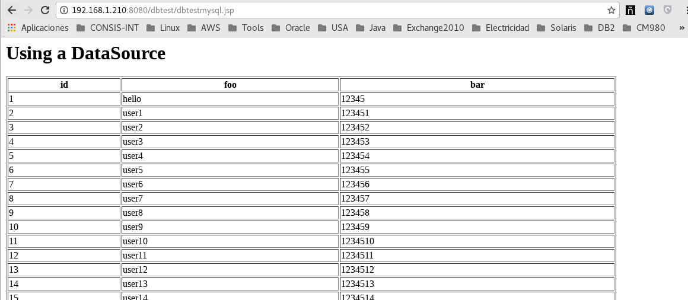

Configurar y probar Datasource 
===============================

Lo primero es leer la documentación oficial de Tomcat.

https://tomcat.apache.org/tomcat-8.0-doc/jndi-datasource-examples-howto.html

Introducción
++++++++++++++

La configuración de JNDI Datasource está cubierta extensamente en JNDI-Resources-HOWTO. Sin embargo, los comentarios de usuarios de tomcat han demostrado que las especificaciones para configuraciones individuales pueden ser bastante complicadas.

Aquí hay algunas configuraciones de ejemplo que se han publicado en tomcat-user para bases de datos populares y algunos consejos generales para el uso de db.

Debe tener en cuenta que estas notas se derivan de la configuración y / o comentarios publicados en el usuario YMMV de tomcat.

Tenga en cuenta que la configuración de recursos JNDI cambió algo entre Tomcat 7.x y Tomcat 8.x ya que están utilizando diferentes versiones de la biblioteca Apache Commons DBCP. Lo más probable es que necesite modificar las configuraciones de recursos JNDI anteriores para que coincidan con la sintaxis en el ejemplo siguiente para que funcionen en Tomcat 8. Consulte la Guía de migración de Tomcat para obtener más información.

Además, tenga en cuenta que la configuración de JNDI DataSource en general, y este tutorial en particular, asume que ha leído y entendido las referencias de configuración Contexto y Host, incluida la sección sobre Implementación automática de aplicaciones en la última referencia.

DriverManager, el mecanismo del proveedor de servicio y pérdidas de memoria
+++++++++++++++++++++++++++++++++++++++++++++++++++++++++++++++++++++++++++++++

java.sql.DriverManager es compatible con el mecanismo del proveedor de servicios. Esta característica es que todos los controladores JDBC disponibles que se anuncian al proporcionar un archivo META-INF / services / java.sql.Driver se descubren, cargan y registran automáticamente, lo que evita la necesidad de cargar el controlador de la base de datos explícitamente antes de crear un archivo. Conexión JDBC. Sin embargo, la implementación está fundamentalmente rota en todas las versiones de Java para un entorno de contenedor de servlets. El problema es que java.sql.DriverManager buscará los controladores solo una vez.

El módulo de escucha de prevención de fuga de memoria JRE que se incluye con Apache Tomcat resuelve esto activando el análisis de los controladores durante el arranque de Tomcat. Esto está habilitado por defecto. Significa que solo las bibliotecas visibles para el oyente como las de $ CATALINA_BASE / lib se analizarán en busca de controladores de base de datos. Si está considerando desactivar esta función, tenga en cuenta que la primera aplicación web que usa JDBC activará el escaneo, lo que ocasionará fallas cuando se vuelva a cargar esta aplicación web y para otras aplicaciones web que dependan de esta característica.

Por lo tanto, las aplicaciones web que tienen controladores de base de datos en su directorio WEB-INF / lib no pueden confiar en el mecanismo del proveedor de servicios y deben registrar los controladores de forma explícita.

La lista de controladores en java.sql.DriverManager también es una fuente conocida de pérdidas de memoria. Todos los controladores registrados por una aplicación web deben cancelarse cuando se detiene la aplicación web. Tomcat intentará descubrir y eliminar automáticamente cualquier controlador JDBC cargado por el cargador de clases de la aplicación web cuando se detenga la aplicación web. Sin embargo, se espera que las aplicaciones lo hagan por sí mismas a través de ServletContextListener.

Database Connection Pool (DBCP 2) Configurations
+++++++++++++++++++++++++++++++++++++++++++++++++

La implementación del grupo de conexiones de la base de datos predeterminada en Apache Tomcat se basa en las bibliotecas del proyecto Apache Commons. Se usan las siguientes bibliotecas:

DBCP Comunes
Pool de los comunes
Estas bibliotecas se encuentran en un único JAR en $ CATALINA_HOME / lib / tomcat-dbcp.jar. Sin embargo, solo se han incluido las clases necesarias para la agrupación de conexiones, y los paquetes se han renombrado para evitar interferir con las aplicaciones.

DBCP 2.0 proporciona soporte para JDBC 4.1.

Preventing database connection pool leaks
+++++++++++++++++++++++++++++++++++++++++++

Un grupo de conexión de base de datos crea y administra un conjunto de conexiones a una base de datos. Reciclar y reutilizar conexiones ya existentes en una base de datos es más eficiente que abrir una nueva conexión.

Hay un problema con la agrupación de conexiones. Una aplicación web debe cerrar explícitamente ResultSet, Statement y Connection's. La falla de una aplicación web para cerrar estos recursos puede hacer que nunca vuelvan a estar disponibles para su reutilización, una "fuga" en el grupo de conexiones de la base de datos. Esto puede ocasionar que las conexiones de la base de datos de la aplicación web fallen si no hay más conexiones disponibles.

Hay una solución a este problema. Apache Commons DBCP se puede configurar para rastrear y recuperar estas conexiones de bases de datos abandonadas. No solo puede recuperarlos, sino también generar un seguimiento de pila para el código que abrió estos recursos y nunca los cerró.

Para configurar un DBCP DataSource para que las conexiones abandonadas de la base de datos se eliminen y se reciclen, agregue uno o ambos de los siguientes atributos a la configuración del recurso para su DBCP DataSource::

	removeAbandonedOnBorrow=true
	removeAbandonedOnMaintenance=true

El valor predeterminado para estos dos atributos es falso. Tenga en cuenta que removeAbandonedOnMaintenance no tiene ningún efecto a menos que el mantenimiento del grupo esté habilitado estableciendo timeBetweenEvictionRunsMillis en un valor positivo. Consulte la documentación de DBCP para obtener la documentación completa sobre estos atributos.

Use el atributo removeAbandonedTimeout para establecer el número de segundos que una conexión de base de datos ha estado inactiva antes de que se considere abandonada.::

	removeAbandonedTimeout="60"

El tiempo de espera predeterminado para eliminar conexiones abandonadas es de 300 segundos.

El atributo logAbandoned se puede establecer en verdadero si desea que DBCP registre un seguimiento de la pila del código que abandonó los recursos de conexión de la base de datos.::

	logAbandoned="true"

Por defecto es false.

MySQL DBCP Example
+++++++++++++++++++

* **Introduccion**

Versiones de los controladores MySQL y JDBC que se ha informado que funcionan, https://dev.mysql.com/downloads/connector/j/5.1.html

* MySQL 3.23.47, MySQL 3.23.47 usan InnoDB,, MySQL 3.23.58, MySQL 4.0.1alpha
* Connector/J 3.0.11-stable (the official JDBC Driver)
* mm.mysql 2.0.14 (an old 3rd party JDBC Driver)

Antes de continuar, no olvide copiar el archivo jar del controlador JDBC en $CATALINA_HOME/lib.

Iniciar el laboratorio
+++++++++++++++++++++++

Creamos un directorio de trabajo.::

	# mkdir dbtest
	# cd dbtest

Creamos la estructura de directorios.::

	# mkdir -p images WEB-INF/classes/mypackage WEB-INF/lib

Copiamos alguna imagen.::

	# cp ../../../../tomcat.gif images/

Copiamos las librerias y los drivers (Los tenemos que descargar).::

	# cp -p ../../../../jstl.jar WEB-INF/lib/
	# cp -p ../../../../standard.jar WEB-INF/lib/
	# cp -p ../../../../ojdbc6.jar WEB-INF/lib/
	# cp -p ../../../../db2jcc.jar WEB-INF/lib/

Copiamos la clase que ya en otro momento compilamos.::

	# cp -p ../../../../Hello.class WEB-INF/classes/mypackage/

Editamos el context.xml del Tomcat para agregar estas lineas dentro del <contex> </context>.::

	# vi /opt/apache-tomcat-8.5.34/conf/context.xml

	<Resource name="jdbc/TestDB" auth="Container" type="javax.sql.DataSource"
		     maxTotal="100" maxIdle="30" maxWaitMillis="10000"
		     username="javauser" password="javadude" driverClassName="com.mysql.jdbc.Driver"
		     url="jdbc:mysql://localhost:3306/javatest"/>

	<Resource name="jdbc/myoracle" auth="Container"
		      type="javax.sql.DataSource" driverClassName="oracle.jdbc.OracleDriver"
		      url="jdbc:oracle:thin:@192.168.1.53:1521:qa12c"
		      username="QA_RRGTGU_V138" password="QA_RRGTGU_V138" maxTotal="20" maxIdle="10"
		      maxWaitMillis="-1"/>

	<Resource name="jdbc/db2" auth="Container"
		      type="javax.sql.DataSource" driverClassName="oracle.jdbc.OracleDriver"
		      url="jdbc:db2://10.124.0.176:50001/bgsample"
		      username="bgadmin" password="zxcv4321" maxTotal="20" maxIdle="10"
		      maxWaitMillis="-1"/>

Creamos el web.xml.::

	# vi WEB-INF/web.xml

	<?xml version="1.0" encoding="ISO-8859-1"?>
	<web-app xmlns="http://java.sun.com/xml/ns/j2ee"
	    xmlns:xsi="http://www.w3.org/2001/XMLSchema-instance"
	    xsi:schemaLocation="http://java.sun.com/xml/ns/j2ee http://java.sun.com/xml/ns/j2ee/web-app_2_4.xsd"
	    version="2.4">

	    <display-name>Hello, World Application</display-name>
	    <description>
		This is a simple web application with a source code organization
		based on the recommendations of the Application Developer's Guide.
	    </description>

	    <servlet>
		<servlet-name>HelloServlet</servlet-name>
		<servlet-class>mypackage.Hello</servlet-class>
	    </servlet>

	    <servlet-mapping>
		<servlet-name>HelloServlet</servlet-name>
		<url-pattern>/hello</url-pattern>
	    </servlet-mapping>

	  <resource-ref>
	      <description>DB Connection</description>
	      <res-ref-name>jdbc/TestDB</res-ref-name>
	      <res-type>javax.sql.DataSource</res-type>
	      <res-auth>Container</res-auth>
	  </resource-ref>

	  <resource-ref>
	      <description>Oracle Datasource example</description>
	      <res-ref-name>jdbc/myoracle</res-ref-name>
	      <res-type>javax.sql.DataSource</res-type>
	      <res-auth>Container</res-auth>
	  </resource-ref>

	  <resource-ref>
	      <description>DB2 Datasource example</description>
	      <res-ref-name>jdbc/db2</res-ref-name>
	      <res-type>javax.sql.DataSource</res-type>
	      <res-auth>Container</res-auth>
	  </resource-ref>

	</web-app>

Creamos el index.html.::

	# vi index.html

	<html>
	<head>
	<title>Sample "Hello, World" Application</title>
	</head>
	<body bgcolor=white>

	<table border="0">
	<tr>
	<td>
	
	</td>
	<td>
	<h1>Sample "Hello, World" Application</h1>
	
This is the home page for a sample application used to illustrate the
	source directory organization of a web application utilizing the principles
	outlined in the Application Developer's Guide.
	</td>
	</tr>
	</table>

	
To prove that they work, you can execute either of the following links:
	<ul>
	<li>To a <a href="dbtestmysql.jsp">Test Datasource MySQL</a>.
	<li>To a <a href="dbtestoracle.jsp">Test Datasource Oracle</a>.
	<li>To a <a href="dbtestdb2.jsp">Test Datasource DB2</a>.
	<li>To a <a href="hello.jsp">JSP page</a>.
	<li>To a <a href="hello">servlet</a>.
	</ul>

	</body>
	</html>

Creamos una JSP solo de demo.::

	<html>
	<head>
	<title>Sample Application JSP Page</title>
	</head>
	<body bgcolor=white>

	<table border="0">
	<tr>
	<td align=center>
	
	</td>
	<td>
	<h1>Sample Application JSP Page</h1>
	This is the output of a JSP page that is part of the Hello, World
	application.
	</td>
	</tr>
	</table>

	<%= new String("Hello!") %>

	</body>
	</html>

Creamos nuestras paginas de test en JSP para cada datasource.
Para MySQL.::

	<%@page import="java.sql.*, javax.sql.*, javax.naming.*"%>
	<html>
	<head>
	<title>Using a DataSource</title>
	</head>
	<body>
	<h1>Using a DataSource</h1>
	<%
	    DataSource ds = null;
	    Connection conn = null;
	    ResultSet result = null;
	    Statement stmt = null;
	    ResultSetMetaData rsmd = null;
	    try{
	      Context context = new InitialContext();
	      Context envCtx = (Context) context.lookup("java:comp/env");
	      ds =  (DataSource)envCtx.lookup("jdbc/TestDB");
	      if (ds != null) {
		conn = ds.getConnection();
		stmt = conn.createStatement();
		result = stmt.executeQuery("SELECT * FROM testdata");
	       }
	     }
	     catch (SQLException e) {
		System.out.println("Error occurred " + e);
	      }
	      int columns=0;
	      try {
		rsmd = result.getMetaData();
		columns = rsmd.getColumnCount();
	      }
	      catch (SQLException e) {
		 System.out.println("Error occurred " + e);
	      }
	 %>
	 <table width="90%" border="1">
	   <tr>
	   <% // write out the header cells containing the column labels
	      try {
		 for (int i=1; i<=columns; i++) {
		      out.write("<th>" + rsmd.getColumnLabel(i) + "</th>");
		 }
	   %>
	   </tr>
	   <% // now write out one row for each entry in the database table
		 while (result.next()) {
		    out.write("<tr>");
		    for (int i=1; i<=columns; i++) {
		      out.write("<td>" + result.getString(i) + "</td>");
		    }
		    out.write("</tr>");
		 }
	 
		 // close the connection, resultset, and the statement
		 result.close();
		 stmt.close();
		 conn.close();
	      } // end of the try block
	      catch (SQLException e) {
		 System.out.println("Error " + e);
	      }
	      // ensure everything is closed
	    finally {
	     try {
	       if (stmt != null)
		stmt.close();
	       }  catch (SQLException e) {}
	       try {
		if (conn != null)
		 conn.close();
		} catch (SQLException e) {}
	    }
	 
	    %>
	</table>
	</body>
	</html>

Para Oracle.::

	<%@page import="java.sql.*, javax.sql.*, javax.naming.*"%>
	<html>
	<head>
	<title>Using a DataSource</title>
	</head>
	<body>
	<h1>Using a DataSource</h1>
	<%
	    DataSource ds = null;
	    Connection conn = null;
	    ResultSet result = null;
	    Statement stmt = null;
	    ResultSetMetaData rsmd = null;
	    try{
	      Context context = new InitialContext();
	      Context envCtx = (Context) context.lookup("java:comp/env");
	      ds =  (DataSource)envCtx.lookup("jdbc/myoracle");
	      if (ds != null) {
		conn = ds.getConnection();
		stmt = conn.createStatement();
		result = stmt.executeQuery("SELECT * FROM CDSE_USER");
	       }
	     }
	     catch (SQLException e) {
		System.out.println("Error occurred " + e);
	      }
	      int columns=0;
	      try {
		rsmd = result.getMetaData();
		columns = rsmd.getColumnCount();
	      }
	      catch (SQLException e) {
		 System.out.println("Error occurred " + e);
	      }
	 %>
	 <table width="90%" border="1">
	   <tr>
	   <% // write out the header cells containing the column labels
	      try {
		 for (int i=1; i<=columns; i++) {
		      out.write("<th>" + rsmd.getColumnLabel(i) + "</th>");
		 }
	   %>
	   </tr>
	   <% // now write out one row for each entry in the database table
		 while (result.next()) {
		    out.write("<tr>");
		    for (int i=1; i<=columns; i++) {
		      out.write("<td>" + result.getString(i) + "</td>");
		    }
		    out.write("</tr>");
		 }
	 
		 // close the connection, resultset, and the statement
		 result.close();
		 stmt.close();
		 conn.close();
	      } // end of the try block
	      catch (SQLException e) {
		 System.out.println("Error " + e);
	      }
	      // ensure everything is closed
	    finally {
	     try {
	       if (stmt != null)
		stmt.close();
	       }  catch (SQLException e) {}
	       try {
		if (conn != null)
		 conn.close();
		} catch (SQLException e) {}
	    }
	 
	    %>
	</table>
	</body>
	</html>

Para DB2.::

	<%@page import="java.sql.*, javax.sql.*, javax.naming.*"%>
	<html>
	<head>
	<title>Using a DataSource</title>
	</head>
	<body>
	<h1>Using a DataSource</h1>
	<%
	    DataSource ds = null;
	    Connection conn = null;
	    ResultSet result = null;
	    Statement stmt = null;
	    ResultSetMetaData rsmd = null;
	    try{
	      Context context = new InitialContext();
	      Context envCtx = (Context) context.lookup("java:comp/env");
	      ds =  (DataSource)envCtx.lookup("jdbc/db2");
	      if (ds != null) {
		conn = ds.getConnection();
		stmt = conn.createStatement();
		result = stmt.executeQuery("SELECT * FROM ALGUNATABLAAQUI");
	       }
	     }
	     catch (SQLException e) {
		System.out.println("Error occurred " + e);
	      }
	      int columns=0;
	      try {
		rsmd = result.getMetaData();
		columns = rsmd.getColumnCount();
	      }
	      catch (SQLException e) {
		 System.out.println("Error occurred " + e);
	      }
	 %>
	 <table width="90%" border="1">
	   <tr>
	   <% // write out the header cells containing the column labels
	      try {
		 for (int i=1; i<=columns; i++) {
		      out.write("<th>" + rsmd.getColumnLabel(i) + "</th>");
		 }
	   %>
	   </tr>
	   <% // now write out one row for each entry in the database table
		 while (result.next()) {
		    out.write("<tr>");
		    for (int i=1; i<=columns; i++) {
		      out.write("<td>" + result.getString(i) + "</td>");
		    }
		    out.write("</tr>");
		 }
	 
		 // close the connection, resultset, and the statement
		 result.close();
		 stmt.close();
		 conn.close();
	      } // end of the try block
	      catch (SQLException e) {
		 System.out.println("Error " + e);
	      }
	      // ensure everything is closed
	    finally {
	     try {
	       if (stmt != null)
		stmt.close();
	       }  catch (SQLException e) {}
	       try {
		if (conn != null)
		 conn.close();
		} catch (SQLException e) {}
	    }
	 
	    %>
	</table>
	</body>
	</html>

Creamos el war.::

	# zip -r dbtest.war *

Desplegamos el war en $CATALINA_HOME/webapp.::

	# cp -p dbtest.war /opt/apache-tomcat-8.5.34/webapps/

Montamos el LOG para ir viendo lo que pasa.::

	# tail -f /opt/apache-tomcat-8.5.34/logs/catalina.out &

Vemos la salida del LOG.::

	21-Sep-2018 10:20:17.341 INFORMACIÓN [localhost-startStop-13] org.apache.catalina.startup.HostConfig.deployWAR Despliegue del archivo [/opt/apache-tomcat-8.5.34/webapps/dbtest.war] de la aplicación web
	21-Sep-2018 10:20:17.518 INFORMACIÓN [localhost-startStop-13] org.apache.jasper.servlet.TldScanner.scanJars Al menos un JAR, que se ha explorado buscando TLDs, aún no contenía TLDs. Activar historial de depuración para este historiador para una completa lista de los JARs que fueron explorados y de los que nos se halló TLDs. Saltarse JARs no necesarios durante la exploración puede dar lugar a una mejora de tiempo significativa en el arranque y compilación de JSP .
	21-Sep-2018 10:20:17.526 INFORMACIÓN [localhost-startStop-13] org.apache.catalina.startup.HostConfig.deployWAR Deployment of web application archive [/opt/apache-tomcat-8.5.34/webapps/dbtest.war] has finished in [185] ms

Probamos ahora en el navegador, http:IPSERVER:8080/dbtest

.. figure:: ../images/datasource/01.png

Seleccionamos el link del MySQL.:

Seleccionamos el link del Oracle.:

.. figure:: ../images/datasource/03.png

