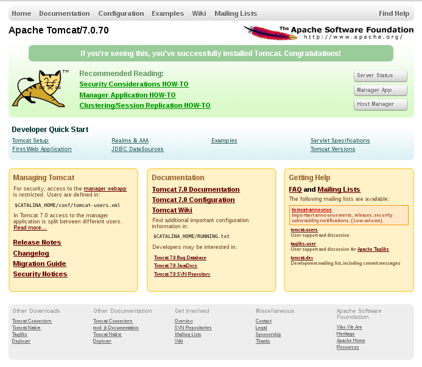
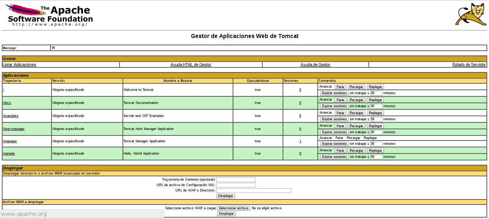
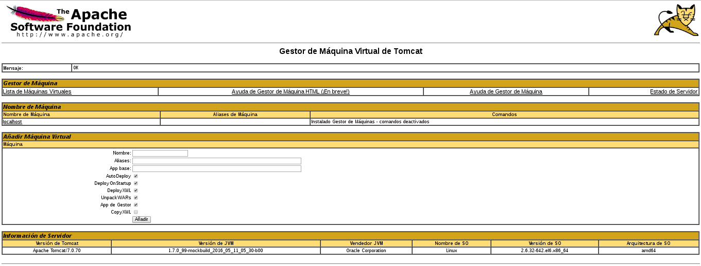
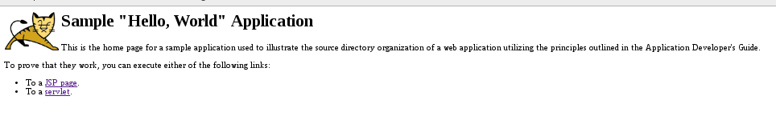

Instalar Tomcat CentOS desde tomcat.apache.org
===============================================

Descargamos el Apache tomcat desde su propia pagina https://tomcat.apache.org

.. figure:: ../images/img05.png

Descomprimimos.::

	# unzip apache-tomcat-7.0.70.zip

Movemos a /opt.::

	# mv apache-tomcat-7.0.70/ /opt/

Nos cambiamos al directorio donde estan los binarios y le otorgamos permisos de ejecucion.::

	# cd /opt/apache-tomcat-7.0.70/bin/
	# chmod +x *.sh

Podemos iniciar el tomcat de las siguientes maneras.::

	# ./catalina.sh start
	Using CATALINA_BASE:   /opt/apache-tomcat-7.0.70
	Using CATALINA_HOME:   /opt/apache-tomcat-7.0.70
	Using CATALINA_TMPDIR: /opt/apache-tomcat-7.0.70/temp
	Using JRE_HOME:        /usr
	Using CLASSPATH:       /opt/apache-tomcat-7.0.70/bin/bootstrap.jar:/opt/apache-tomcat-7.0.70/bin/tomcat-juli.jar
	Tomcat started.

::

	# ./startup.sh
	Using CATALINA_BASE:   /opt/apache-tomcat-7.0.70
	Using CATALINA_HOME:   /opt/apache-tomcat-7.0.70
	Using CATALINA_TMPDIR: /opt/apache-tomcat-7.0.70/temp
	Using JRE_HOME:        /usr
	Using CLASSPATH:       /opt/apache-tomcat-7.0.70/bin/bootstrap.jar:/opt/apache-tomcat-7.0.70/bin/tomcat-juli.jar
	Tomcat started.

Verificamos.::

	# ps -ef | grep --color tomcat
	root      3764     1  7 20:34 pts/0    00:00:03 /usr/bin/java -Djava.util.logging.config.file=/opt/apache-tomcat-7.0.70/conf/logging.properties -Djava.util.logging.manager=org.apache.juli.ClassLoaderLogManager -Djdk.tls.ephemeralDHKeySize=2048 -Djava.endorsed.dirs=/opt/apache-tomcat-7.0.70/endorsed -classpath /opt/apache-tomcat-7.0.70/bin/bootstrap.jar:/opt/apache-tomcat-7.0.70/bin/tomcat-juli.jar -Dcatalina.base=/opt/apache-tomcat-7.0.70 -Dcatalina.home=/opt/apache-tomcat-7.0.70 -Djava.io.tmpdir=/opt/apache-tomcat-7.0.70/temp org.apache.catalina.startup.Bootstrap start

	# netstat -nat | grep -w 8080
	tcp        0      0 :::8080                     :::*                        LISTEN 

Configuramos el Tomcat Web Management Interface
Para utilizar el manager webapp instalado en pasos previos, necesitamos agregar un login al Tomcat server. para eso editamos el archivo tomcat-users.xml.::

	# vi conf/tomcat-users.xml
	<tomcat-users>
	  <user name="admin" password="admin" roles="manager-gui,admin-gui" />-->
	</tomcat-users>

Se debe agregar usuarios que puedan administrar manager-gui y admin-gui (recuerda colocar el usuario y password)

Reiniciamos.::

	# ./catalina.sh stop
	# ./catalina.sh start

Recuerda el Delay, demora. Cargamos la pagina http://localhost:8080

Probamos el tomcat en http://localhost:8080/manager/html

El Web Application Manager es usuado para manejar sus Java applications. Se puede Start, Stop, Reload, Deploy, and Undeploy desde aqui. Se pueden correr diagnosticos de la app (ej. find memory leaks). Lastly, information del server si esta disponible.

Ahora vamos a ver Host Manager, por medio de este link. 
http://localhost:8080/host-manager/html

Desde Virtual Host Manager, se pueden agregar virtual hosts desde la aplicacion al server.

Vamos hacer un despliegue de una aplicacion .war, lo podemos copiar  y descomprimir en  /opt/apache-tomcat-7.0.70/webapps/ y descomprimirlo ahi o hacerlo desde Web Application Manager. 
Hay un .war de ejemplo en este repositorio llamado sample.war.::

	# jar xfv sample.war 

Y probamos el aplicativo, http://localhost:8080/sample

