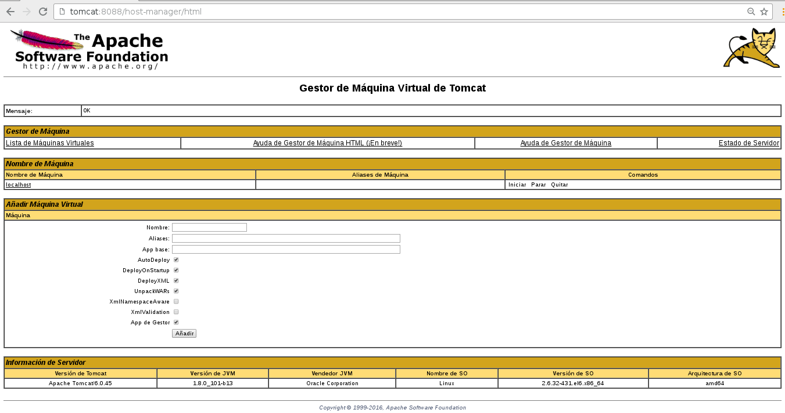

Instalar Tomcat 6 CentOS desde tomcat.apache.org
===============================================

Descargamos el Apache tomcat desde su propia pagina https://tomcat.apache.org

Descomprimimos.::

	# unzip apache-tomcat-6.0.45.zip

Movemos a /opt.::

	# mv apache-tomcat-6.0.45/ /opt/

Nos cambiamos al directorio donde estan los binarios y le otorgamos permisos de ejecucion.::

	# cd /opt/apache-tomcat-6.0.45/bin/
	# chmod +x *.sh

Instalamos JAVA.::

	# rpm -ivh jdk-8u101-linux-x64.rpm

Configuramos el update-alternative para java.::

	# update-alternatives --config java

	Hay 1 programa que proporciona 'java'.

	  Selección    Comando
	-----------------------------------------------
	*+ 1           /usr/java/jdk1.8.0_101/jre/bin/java

Configuramos la variable JAVA_HOME para los perfiles de los usuarios.::

	# vi /etc/profile

	export JAVA_HOME=/usr/java/jdk1.8.0_101
	export PATH=$PATH:$JAVA_HOME/jre/bin

Verificamos el java.::

	# java -version
	java version "1.8.0_101"
	Java(TM) SE Runtime Environment (build 1.8.0_101-b13)
	Java HotSpot(TM) 64-Bit Server VM (build 25.101-b13, mixed mode)

Continuamos con la configuracion de Tomcat.
+++++++++++++++++++++++++++++++++++++++++++++

Revisamos el contenido de la carpeta tomcat::

	# ls -l
	total 124
	drwxr-xr-x. 2 root root  4096 feb  1  2016 bin
	drwxr-xr-x. 2 root root  4096 feb  1  2016 conf
	drwxr-xr-x. 2 root root  4096 feb  1  2016 lib
	-rw-r--r--. 1 root root 57727 feb  1  2016 LICENSE
	drwxr-xr-x. 2 root root  4096 feb  1  2016 logs
	-rw-r--r--. 1 root root   829 feb  1  2016 NOTICE
	-rw-r--r--. 1 root root  9124 feb  1  2016 RELEASE-NOTES
	-rw-r--r--. 1 root root 16696 feb  1  2016 RUNNING.txt
	drwxr-xr-x. 2 root root  4096 feb  1  2016 temp
	drwxr-xr-x. 7 root root  4096 feb  1  2016 webapps
	drwxr-xr-x. 2 root root  4096 feb  1  2016 work

bin: contiene los binarios y scripts de tomcat.

conf: archivos de configuracion web.xml, server.xml, context.xml, tomcat-users.xml

lib: las librerias necesarias para tomcat y el webapps.

logs: archivos de logs.

webapps: donde las aplicaciones seran ejecutadas.

work: directorio usado para el runtime.

temp: archivos temporales.

Modificaremos los 4 archivos de configuración de tomcat

server.xml lo cambiamos de 8080 a 8088.::

    <Connector port="8088" protocol="HTTP/1.1"
               connectionTimeout="20000"
               redirectPort="8443" />

web.xml Activamos la característica listings de false a true, esto permite el listado de directorios (Nunca para producción).::

    <servlet>
        <servlet-name>default</servlet-name>
        <servlet-class>org.apache.catalina.servlets.DefaultServlet</servlet-class>
        <init-param>
            <param-name>debug</param-name>
            <param-value>0</param-value>
        </init-param>
        <init-param>
            <param-name>listings</param-name>
            <param-value>true</param-value>
        </init-param>
        <load-on-startup>1</load-on-startup>
    </servlet>

context.xml Aquí activamos la opción de auto actualizar cuando el código cambie.::

	<Context>

		<!-- Default set of monitored resources -->
		<WatchedResource>WEB-INF/web.xml</WatchedResource>

		<!-- Uncomment this to disable session persistence across Tomcat restarts -->
		<!--
		<Manager pathname="" />
		-->

		<!-- Uncomment this to enable Comet connection tacking (provides events
		     on session expiration as well as webapp lifecycle) -->
		<!--
		<Valve className="org.apache.catalina.valves.CometConnectionManagerValve" />
		-->

	</Context>

tomcat-users.xml Agregamos el tomcat manager-GUI y el admin-GUI, Se debe agregar usuarios que puedan administrar manager-gui y admin-gui (recuerda colocar el usuario y password) agregando.::

	<tomcat-users>
	<role rolename="manager-gui"/>
	<user username="admin" password="admin" roles="manager-gui"/>
	<role rolename="admin-gui"/>
	<user username="tomcat" password="admin" roles="admin-gui"/>
	</tomcat-users>

Podemos iniciar el tomcat de las siguientes maneras.::

	# /opt/apache-tomcat-6.0.45/bin/catalina.sh start
	Using CATALINA_BASE:   /opt/apache-tomcat-6.0.45
	Using CATALINA_HOME:   /opt/apache-tomcat-6.0.45
	Using CATALINA_TMPDIR: /opt/apache-tomcat-6.0.45/temp
	Using JRE_HOME:        /usr/java/jdk1.8.0_101
	Using CLASSPATH:       /opt/apache-tomcat-6.0.45/bin/bootstrap.jar

Ponemos en otra ventana un tail del log para ver todos los eventos.::

	# tail -f /opt/apache-tomcat-6.0.45/logs/catalina.out &

Otra forma de iniciar::

	# /opt/apache-tomcat-6.0.45/bin/startup.sh
	Using CATALINA_BASE:   /opt/apache-tomcat-6.0.45
	Using CATALINA_HOME:   /opt/apache-tomcat-6.0.45
	Using CATALINA_TMPDIR: /opt/apache-tomcat-6.0.45/temp
	Using JRE_HOME:        /usr/java/jdk1.8.0_101
	Using CLASSPATH:       /opt/apache-tomcat-6.0.45/bin/bootstrap.jar

Verificamos.::

	# ps -ef | grep --color tomcat
	root      1712  1647  0 20:12 pts/0    00:00:00 tail -f /opt/apache-tomcat-6.0.45/logs/catalina.out
	root      1969     1  3 20:19 pts/0    00:00:03 /usr/java/jdk1.8.0_101/bin/java -Djava.util.logging.config.file=/opt/apache-tomcat-6.0.45/conf/logging.properties -Djava.util.logging.manager=org.apache.juli.ClassLoaderLogManager -Djava.endorsed.dirs=/opt/apache-tomcat-6.0.45/endorsed -classpath /opt/apache-tomcat-6.0.45/bin/bootstrap.jar -Dcatalina.base=/opt/apache-tomcat-6.0.45 -Dcatalina.home=/opt/apache-tomcat-6.0.45 -Djava.io.tmpdir=/opt/apache-tomcat-6.0.45/temp org.apache.catalina.startup.Bootstrap start

	# netstat -nat | grep -w 8088
	tcp        0      0 :::8088                    :::*                        LISTEN 

Como detener el servicio .::

	# /opt/apache-tomcat-6.0.45/bin/catalina.sh stop
	Using CATALINA_BASE:   /opt/apache-tomcat-6.0.45
	Using CATALINA_HOME:   /opt/apache-tomcat-6.0.45
	Using CATALINA_TMPDIR: /opt/apache-tomcat-6.0.45/temp
	Using JRE_HOME:        /usr/java/jdk1.8.0_101
	Using CLASSPATH:       /opt/apache-tomcat-6.0.45/bin/bootstrap.jar
	ago 23, 2017 8:22:25 PM org.apache.coyote.http11.Http11Protocol pause
	INFORMACIÓN: Pausando Coyote HTTP/1.1 en puerto http-808

Recuerda el Delay, demora. Cargamos la pagina http://localhost:8088

Iniciamos el servicio de tomcat y probamos el tomcat en http://localhost:8088/manager/html

El Web Application Manager es usuado para manejar sus Java applications. Se puede Start, Stop, Reload, Deploy, and Undeploy desde aqui. Se pueden correr diagnosticos de la app (ej. find memory leaks). Lastly, information del server si esta disponible.

Ahora vamos a ver Host Manager, por medio de este link. 
http://localhost:8088/host-manager/html

Desde Virtual Host Manager, se pueden agregar virtual hosts desde la aplicacion al server.

Vamos hacer un despliegue de una aplicacion .war, lo podemos copiar  y descomprimir en  /opt/apache-tomcat-6.0.45/webapps/ y descomprimirlo ahi o hacerlo desde Web Application Manager. 
Hay un .war de ejemplo en este repositorio llamado sample.war.::

	# mv /tmp/sample.war .
	[root@tomcat webapps]# ago 23, 2017 8:36:40 PM org.apache.catalina.startup.HostConfig deployWAR
	INFORMACIÓN: Despliegue del archivo sample.war de la aplicación web

	# ls 
	docs  examples  host-manager  manager  ROOT  sample  sample.war

Y probamos el aplicativo, http://localhost:8088/sample

