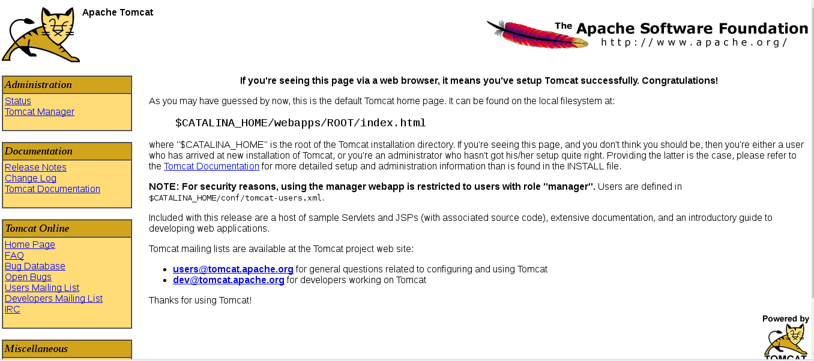
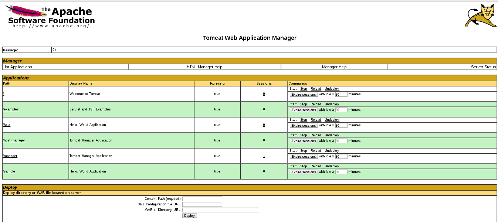
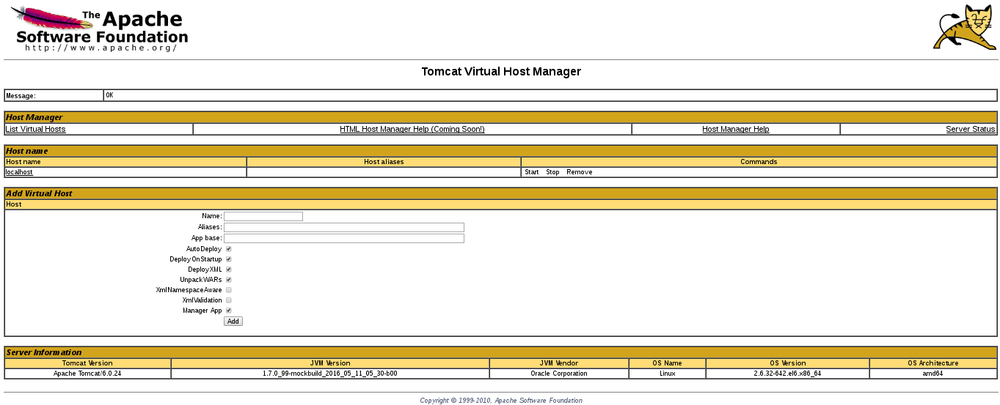

Instalar Tomcat con yum en  CentOS
==================================

Instalamos tomcat desde el repositorio.::

	# yum install tomcat6

Siempre dicen que los archivos mas importantes estan en /usr/share/tomcat, pero si los listamos vemos que son link simbolic.::

	# ls -l /usr/share/tomcat6/
	total 4
	drwxr-xr-x. 2 root root   4096 ago 30 20:33 bin
	lrwxrwxrwx. 1 root tomcat   12 ago 30 20:33 conf -> /etc/tomcat6
	lrwxrwxrwx. 1 root tomcat   23 ago 30 20:33 lib -> /usr/share/java/tomcat6
	lrwxrwxrwx. 1 root tomcat   16 ago 30 20:33 logs -> /var/log/tomcat6
	lrwxrwxrwx. 1 root tomcat   23 ago 30 20:33 temp -> /var/cache/tomcat6/temp
	lrwxrwxrwx. 1 root tomcat   24 ago 30 20:33 webapps -> /var/lib/tomcat6/webapps
	lrwxrwxrwx. 1 root tomcat   23 ago 30 20:33 work -> /var/cache/tomcat6/work

Si ya tenemos una aplicacion la podemos colocar en /var/lib/tomcat6/webapps y reiniciamos tomcat y ya tendremos una aplicacion desplegada. Estoy utilizando un .war que esta en el repositorio. Instaleremos otros paquetes adicionales de importancia que ayudan al manejo de, Tomcat applications and virtual hosts.::

	# yum install tomcat6-webapps tomcat6-admin-webapps

Esto adiciona ROOT, examples, sample, manager y host-manager web apps en tomcat/webapps directorio.

Si queremos documentacion.::

	# yum install tomcat6-docs-webapp tomcat6-javadoc

Vamos hacer un pequeño cambio a las opciones de Java del Tomcat utiliza para iniciar. abrimos la configuracion del tomcat.::

	# vi vi /usr/share/tomcat6/conf/tomcat6.conf

Agregamos la linea de JAVA_OPTS y le colocamos Xmx y MaxPermSize, estos valores configuran como la metoria de tomcat sera utilizada.::

	JAVA_OPTS="-Djava.security.egd=file:/dev/./urandom -Djava.awt.headless=true -Xmx512m -XX:MaxPermSize=256m -XX:+UseConcMarkSweepGC"

Ya podemos iniciar el tomcat para probarlo.::

	# /etc/init.d/tomcat6 start

Cargamos la pagina http://localhost:8080

Configuramos el Tomcat Web Management Interface
Para utilizar el manager webapp instalado en pasos previos, necesitamos agregar un login al Tomcat server. para eso editamos el archivo tomcat-users.xml.::

	# vi /etc/tomcat6/tomcat-users.xml
	<tomcat-users>
	  <user name="admin" password="admin" roles="manager,admin" />-->
	</tomcat-users>

Se debe agregar usuarios qeu puedan administrar manager-gui y admin-gui (recuerda colocar el usuario y password)

Reiniciamos.::

	# /etc/init.d/tomcat6 restart

Probamos el tomcat en http://localhost:8080

Probamos el tomcat en http://localhost:8080/manager/html

El Web Application Manager es usuado para manejar sus Java applications. Se puede Start, Stop, Reload, Deploy, and Undeploy desde aqui. Se pueden correr diagnosticos de la app (ej. find memory leaks). Lastly, information del server si esta disponible.

Ahora vamos a ver Host Manager, por medio de este link. 
http://localhost:8080/host-manager/html

Desde Virtual Host Manager, se pueden agregar virtual hosts desde la aplicacion al server.

Vamos hacer un despliegue de una aplicacion .war, lo podemos copiar  y descomprimir en  /var/lib/tomcat6/webapps y descomprimirlo ahi o hacerlo desde Web Application Manager. 
Hay un .war de ejemplo en este repositorio llamado sample.war.::

	# jar xfv sample.war 

Y probamos el aplicativo, http://localhost:8080/sample

.. figure:: ../images/img04.png

