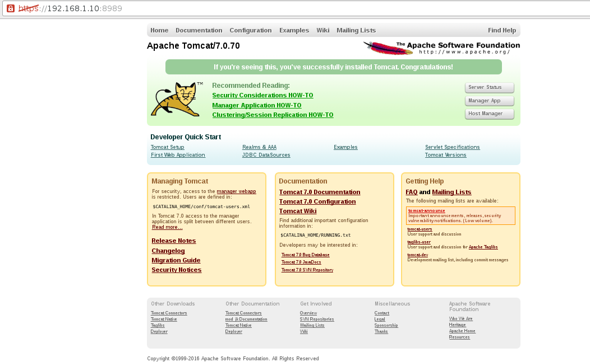

SSL
====

Todo esta aqui https://tomcat.apache.org/tomcat-6.0-doc/ssl-howto.html
configurar Tomcat para acceder a las aplicaciones web empleando HTTP sobre SSL.

Generamos un certificado autofirmado y cambiar la configuración server.xml para activar un conector SSL.

Creando el almacén de claves y un certificado autofirmado.::

	# $JAVA_HOME/bin/keytool -genkey -alias tomcat -keyalg RSA
		Enter keystore password:Venezuela21
		Re-enter new password:Venezuela21
		They don't match. Try again
		Enter keystore password:
		Re-enter new password:
		What is your first and last name?
		  [Unknown]:  Carlos Gomez
		What is the name of your organizational unit?
		  [Unknown]:  TI
		What is the name of your organization?
		  [Unknown]:  Curso Infraestructura
		What is the name of your City or Locality?
		  [Unknown]:  CCS
		What is the name of your State or Province?
		  [Unknown]:  DC
		What is the two-letter country code for this unit?
		  [Unknown]:  VE
		Is CN=Carlos Gomez, OU=TI, O=Curso Infraestructura, L=CCS, ST=DC, C=VE correct?
		  [no]:  yes

		Enter key password for <tomcat>
				(RETURN if same as keystore password):

Warning:
The JKS keystore uses a proprietary format. It is recommended to migrate to PKCS12 which is an industry standard format using "keytool -importkeystore -srckeystore /root/.keystore -destkeystore /root/.keystore -deststoretype pkcs12".

Recordemos que en Tomcat  “changeit”  es la clave por defecto. Si queremos usar cualquier otra clave, lo único que tenemos que hacer es añadir al Connector el parámetro keystorePass especificando la clave a usar.

Pide nuestro nombre, el nombre de nuestra unidad de organización, el nombre de nuestra organización, la ciudad o localidad, el estado o provincia, y el código del pais. Nos pregunta si los datos introducidos son correctos.

Pide la contraseña clave para <tomcat>. Visualmente permite una distinta, pero siempre debemos poner la misma contraseña. (Nos da la opción de pulsar INTRO para este efecto). Informacion de http://tomcat.apache.org/tomcat-6.0-doc/ssl-howto.html. Tomcat lanzaría un java.io.IOException: Cannot recover key si no usaramos la misma clave

Se crea un archivo .keystore en el perfil del usuario que se ejecuto, en este caso en /root/.keystore

Ahora en /opt/apache-tomcat-7.0.70/conf/server.xml descomentar la parte del Connector SSL y agregar dos lineas, una de la ruta del .keystore y la otra de la clave.::

Consultamos el JKS::

	# $JAVA_HOME/bin/keytool -list -v -keystore /opt/KeyStore.jks
		Enter keystore password:
		Keystore type: jks
		Keystore provider: SUN

		Your keystore contains 1 entry

		Alias name: tomcat
		Creation date: Apr 24, 2020
		Entry type: PrivateKeyEntry
		Certificate chain length: 1
		Certificate[1]:
		Owner: CN=Carlos Gomez, OU=TI, O=Curso Infraestructura, L=CCS, ST=DC, C=VE
		Issuer: CN=Carlos Gomez, OU=TI, O=Curso Infraestructura, L=CCS, ST=DC, C=VE
		Serial number: 1e4964ab
		Valid from: Fri Apr 24 21:23:10 VET 2020 until: Thu Jul 23 21:23:10 VET 2020
		Certificate fingerprints:
				 MD5:  CF:DB:90:7F:79:87:84:E6:67:B8:E1:EE:40:7A:6E:E7
				 SHA1: 77:8A:EE:84:6D:91:FB:93:7E:F7:92:7F:07:58:F2:B6:A3:7D:70:9B
				 SHA256: E5:5D:13:6A:43:83:06:D7:56:9F:5E:3C:E6:CD:91:AC:63:85:51:DD:00:FC:6E:DA:7F:32:A3:35:6A:16:C4:BD
		Signature algorithm name: SHA256withRSA
		Subject Public Key Algorithm: 2048-bit RSA key
		Version: 3

		Extensions:

		#1: ObjectId: 2.5.29.14 Criticality=false
		SubjectKeyIdentifier [
		KeyIdentifier [
		0000: 51 A9 69 1C 63 0E 26 30   C2 95 F7 F3 77 2E B3 EC  Q.i.c.&0....w...
		0010: CE 1E CB 11                                        ....
		]
		]

		*******************************************
		*******************************************

		Warning:
		The JKS keystore uses a proprietary format. It is recommended to migrate to PKCS12 which is an industry standard format using "keytool -importkeystore -srckeystore /opt/KeyStore.jks -destkeystore /opt/KeyStore.jks -deststoretype pkcs12".

En el archivo de configuraciòn $CATALINA_HOME/conf/server.xml, lo editamos buscamos el siguiente conector::

    <Connector port="8443" protocol="org.apache.coyote.http11.Http11NioProtocol"
               maxThreads="150" SSLEnabled="true" scheme="https" secure="true"
               clientAuth="false" sslProtocol="TLS"
               keystoreFile="/opt/KeyStore.jks"
               keystorePass="Venezuela21">
        <!--
        <SSLHostConfig>
            <Certificate certificateKeystoreFile="conf/localhost-rsa.jks"
                         type="RSA" />
        </SSLHostConfig>
        -->
    </Connector>

Podemos utilizart otros puertos, verificamos, https://localhost:8443

Connector HTTP
++++++++++++++

El elemento del conector HTTP representa un componente del conector que admite el protocolo HTTP / 1.1. 
Permite a Catalina funcionar como un servidor web independiente, además de su capacidad para ejecutar servlets y páginas JSP. 
Una instancia particular de este componente escucha las conexiones en un número de puerto TCP específico en el servidor. 
Uno o más de estos conectores se pueden configurar como parte de un único servicio, cada uno de los cuales se reenvía al motor asociado para realizar el procesamiento de solicitudes y crear la respuesta.

Si desea configurar el conector que se utiliza para las conexiones a servidores web utilizando el protocolo AJP (como el conector mod_jk 1.2.x para Apache 1.3), consulte la documentación del conector AJP.

Cada solicitud entrante requiere un hilo para la duración de esa solicitud. 
Si se reciben más solicitudes simultáneas de las que pueden manejar los hilos de procesamiento de solicitudes disponibles actualmente, 
se crearán hilos adicionales hasta el máximo configurado (el valor del atributo maxThreads). 
Si aún se reciben más solicitudes simultáneas, se apilan dentro del socket del servidor creado por el conector, hasta el máximo configurado (el valor del atributo acceptCount). 
Cualquier otra solicitud simultánea recibirá errores de "conexión rechazada", hasta que haya recursos disponibles para procesarlos.

Configuracion en el server.xml::

    <Connector address="192.168.1.20" port="8443" protocol="org.apache.coyote.http11.Http11NioProtocol"
               maxThreads="150" SSLEnabled="true" scheme="https" secure="true"
               clientAuth="false" sslProtocols="TLSv1,TLSv1.1,TLSv1.2"
               ciphers="TLS_ECDHE_RSA_WITH_3DES_EDE_CBC_SHA, TLS_RSA_WITH_AES_128_CBC_SHA, TLS_ECDHE_RSA_WITH_AES_128_CBC_SHA, TLS_RSA_WITH_AES_128_CBC_SHA256, TLS_RSA_WITH_AES_128_GCM_SHA256, TLS_ECDHE_RSA_WITH_AES_128_CBC_SHA256, TLS_ECDHE_RSA_WITH_AES_128_GCM_SHA256, TLS_RSA_WITH_AES_256_CBC_SHA, TLS_ECDHE_RSA_WITH_AES_256_CBC_SHA, TLS_RSA_WITH_AES_256_CBC_SHA256, TLS_RSA_WITH_AES_256_GCM_SHA384, TLS_ECDHE_RSA_WITH_AES_256_CBC_SHA384, TLS_ECDHE_RSA_WITH_AES_256_GCM_SHA384"
               keystoreFile="/opt/KeyStore.jks"
               keystorePass="Venezuela21"
               maxKeepAliveRequests="100" socketBuffer="9000"
               maxSpareProcessors="200" maxProcessors="400"
               minProcessors="10">
        <!--
        <SSLHostConfig>
            <Certificate certificateKeystoreFile="conf/localhost-rsa.jks"
                         type="RSA" />
        </SSLHostConfig>
        -->
    </Connector>

La siguiente cofiguración aplica si en Tomcat requiere del tag SSLHostConfig::

	<Connector address="10.134.3.35" port="443" protocol="org.apache.coyote.http11.Http11NioProtocol"
		maxThreads="150" SSLEnabled="true" >
		<UpgradeProtocol className="org.apache.coyote.http2.Http2Protocol" />
		<SSLHostConfig
		clientAuth="false"
		protocols="TLSv1.2"
		ciphers="TLS_ECDHE_RSA_WITH_AES_128_GCM_SHA256,TLS_DHE_RSA_WITH_AES_128_GCM_SHA256,TLS_ECDHE_RSA_WITH_AES_128_CBC_SHA256,TLS_ECDHE_RSA_WITH_AES_128_CBC_SHA" >
		<Certificate certificateKeystoreFile="conf/certs/keystore.jks"
		certificateKeystorePassword="Venezuela21"
		certificateKeystoreType="JKS"
		type="RSA" />
		</SSLHostConfig>
	</Connector>

Consultamos el SSL de nuestro Tomcat::

	# openssl s_client -connect 192.168.1.20:8443
		CONNECTED(00000003)
		depth=0 C = VE, ST = DC, L = CCS, O = Curso Infraestructura, OU = TI, CN = Carlos Gomez
		verify error:num=18:self signed certificate
		verify return:1
		depth=0 C = VE, ST = DC, L = CCS, O = Curso Infraestructura, OU = TI, CN = Carlos Gomez
		verify return:1
		---
		Certificate chain
		 0 s:/C=VE/ST=DC/L=CCS/O=Curso Infraestructura/OU=TI/CN=Carlos Gomez
		   i:/C=VE/ST=DC/L=CCS/O=Curso Infraestructura/OU=TI/CN=Carlos Gomez
		---
		Server certificate
		-----BEGIN CERTIFICATE-----
		MIIDdzCCAl+gAwIBAgIEHklkqzANBgkqhkiG9w0BAQsFADBsMQswCQYDVQQGEwJW
		RTELMAkGA1UECBMCREMxDDAKBgNVBAcTA0NDUzEeMBwGA1UEChMVQ3Vyc28gSW5m
		cmFlc3RydWN0dXJhMQswCQYDVQQLEwJUSTEVMBMGA1UEAxMMQ2FybG9zIEdvbWV6
		MB4XDTIwMDQyNTAxMjMxMFoXDTIwMDcyNDAxMjMxMFowbDELMAkGA1UEBhMCVkUx
		CzAJBgNVBAgTAkRDMQwwCgYDVQQHEwNDQ1MxHjAcBgNVBAoTFUN1cnNvIEluZnJh
		ZXN0cnVjdHVyYTELMAkGA1UECxMCVEkxFTATBgNVBAMTDENhcmxvcyBHb21lejCC
		ASIwDQYJKoZIhvcNAQEBBQADggEPADCCAQoCggEBAMWccVFAmO8Mb3aLqB0gpLc9
		RgVuIObWCqITDE/cIMBSEJ8s0Nj/mS+DQFsjbEjjjLOMHNoKrWyfHUISBwiGwG/g
		fHy9BZ+hDzauZdbBvuXNzqgbeDOuJSFzQSObofjItu4439NEkfIUljE5o+V7c22w
		LOH8bXwxOQZ4z0zoGhs3xohZGEzsTLXOPyWMRMzSZLUmv2OOV5+aZngcNcuEIx7m
		wZ6n9xZNYJxjpD6fI8/ujOzIUKdx704F11b3+AUzucRTDMk4NbobfBwnoC+fMtmw
		KoIXEzN7xjIVdEoD/ITmUd38hgURXoLvVP85VHZUHudsnR7K4dROIkqiFXk3d0MC
		AwEAAaMhMB8wHQYDVR0OBBYEFFGpaRxjDiYwwpX383cus+zOHssRMA0GCSqGSIb3
		DQEBCwUAA4IBAQAKyMzixvGSlG3mvwHVJtLVDuhzQfHi+MGijNgOlG/6YYNP4LC4
		ji9QvaSTMdvOp8ZZvQ2tCSSTbLOLe7VkmjfHgzLX7iU117xGqaVYyDzUeTtmdF2n
		tzQptoWP2mmg/Cssv2ksYHY7wA83MQs9Zsa/8awEazpNg+xYv5IRUmReci3VG/ff
		qyMfkUc5xYkG7hBrap0lIKD3ZkyRm7+y7WZF9soRz4Ehj3idkm2JRjaoth39E9Sb
		4U0j1SHaFV2pvGo48bC2hfv26Jjn3C8DTIqbQoa0Dt+HwOF0S4dVUhlV9ex5GLTC
		KOWApOiAfdT9ZN2YxUe4HwqZFou+ji39k5xr
		-----END CERTIFICATE-----
		subject=/C=VE/ST=DC/L=CCS/O=Curso Infraestructura/OU=TI/CN=Carlos Gomez
		issuer=/C=VE/ST=DC/L=CCS/O=Curso Infraestructura/OU=TI/CN=Carlos Gomez
		---
		No client certificate CA names sent
		Peer signing digest: SHA512
		Server Temp Key: ECDH, P-256, 256 bits
		---
		SSL handshake has read 1375 bytes and written 415 bytes
		---
		New, TLSv1/SSLv3, Cipher is ECDHE-RSA-AES256-GCM-SHA384
		Server public key is 2048 bit
		Secure Renegotiation IS supported
		Compression: NONE
		Expansion: NONE
		No ALPN negotiated
		SSL-Session:
			Protocol  : TLSv1.2
			Cipher    : TLS_ECDHE_ECDSA_WITH_AES_256_GCM_SHA384
			Session-ID: 5EA39A07FC7B76592CF1CC9789ADF0626A27CF1EB157BB78F60BE27BE99D3347
			Session-ID-ctx:
			Master-Key: 1EB1511B117A4489BCA47561349F6D3898164E54C233E7E05193D5D61FD560F86BF2C96A554E9CA64C48F6AD7E4C40E1
			Key-Arg   : None
			Krb5 Principal: None
			PSK identity: None
			PSK identity hint: None
			Start Time: 1587780102
			Timeout   : 300 (sec)
			Verify return code: 18 (self signed certificate)
	---
Esta configuracion me funciono con Tomcat 10
================================================

Los certificados simplemente los cambie a **pem** y colocamos esta configuracion::

	<Connector port="443"
	           protocol="org.apache.coyote.http11.Http11NioProtocol"
	           maxThreads="100"
	           compression="on"
	           scheme="https"
	           SSLEnabled="true"
	           secure="true"
	           defaultSSLHostConfigName="test.test">
	    <SSLHostConfig hostName="test.test"
	                   protocols="TLSv1.2">
	        <Certificate certificateFile="/certs/crtsencamer.pem"
	                     certificateKeyFile="/certs/keysencamer.pem"
	                     certificateChainFile="/certs/ca.pem" />
	    </SSLHostConfig>
	</Connector>

Esta configuracion me funciono con Tomcat 7
================================================

¨Permite unicamente TLS1.2 y Ciphers del **least strength: A** the best rating, según nmap::

	<Connector port="443" protocol="org.apache.coyote.http11.Http11NioProtocol"
	           maxThreads="150" SSLEnabled="true" scheme="https" secure="true"
	           clientAuth="false" sslProtocol="TLS" sslEnabledProtocols="TLSv1.2"
	           ciphers="TLS_ECDHE_ECDSA_WITH_AES_128_GCM_SHA256, TLS_ECDHE_ECDSA_WITH_AES_256_GCM_SHA384, TLS_ECDHE_ECDSA_WITH_AES_128_CBC_SHA256, TLS_ECDHE_ECDSA_WITH_AES_256_CBC_SHA384, TLS_ECDHE_RSA_WITH_AES_128_GCM_SHA256, TLS_ECDHE_RSA_WITH_AES_256_GCM_SHA384, TLS_ECDHE_RSA_WITH_AES_128_CBC_SHA256, TLS_ECDHE_RSA_WITH_AES_256_CBC_SHA384, TLS_ECDHE_RSA_WITH_AES_128_CBC_SHA256, TLS_ECDHE_RSA_WITH_AES_256_CBC_SHA384, TLS_DHE_RSA_WITH_AES_128_GCM_SHA256, TLS_DHE_RSA_WITH_AES_256_GCM_SHA384, TLS_DHE_RSA_WITH_AES_128_CBC_SHA, TLS_DHE_RSA_WITH_AES_256_CBC_SHA, TLS_DHE_RSA_WITH_AES_128_CBC_SHA256, TLS_DHE_RSA_WITH_AES_256_CBC_SHA256, TLS_ECDHE_ECDSA_WITH_CHACHA20_POLY1305_SHA256, TLS_ECDHE_ECDSA_WITH_CHACHA20_POLY1305, TLS_ECDHE_RSA_WITH_CHACHA20_POLY1305_SHA256, TLS_ECDHE_RSA_WITH_CHACHA20_POLY1305"
	           keystoreFile="/root/certs/dominio.local.jks"
	           keystorePass="Venezuela21">
	    <!--
	    <SSLHostConfig>
	        <Certificate certificateKeystoreFile="conf/localhost-rsa.jks"
	                     type="RSA" />
	    </SSLHostConfig>
	    -->
	</Connector>

